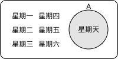
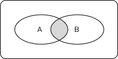
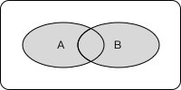
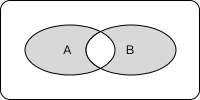
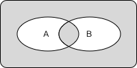
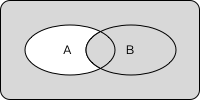

>程序员的数学1: 数学思维
>
>create: 201801140700 60
>log: 2018011200835 

# 第 1 章 0 的故事

## N 进制计数法

$a_n$ : 该数字的第几位的数值；
$N$ : 进制

$$a_3 \times N^3 + a_2 \times N^2 + a_1 \times N^1 + a_0 \times N^0$$

$$\sum_{i = 0}^{n} a_i \times N^i$$

## 指数法则

* 指数规律

$10^3 = 1000 = 1 \times 10 \times 10 \times 10$
$10^2 = 100 = 1 \times 10 \times 10$
$10^1 = 10 = 1 \times 10$
$10^0 = 1 = 1$
$10^{-1} = \frac{1}{10} = \frac{1}{10^1} = 1 \div 10$
$10^{-2} = \frac{1}{100} = \frac{1}{10^2} = 1 \div 10 \div 10$
$10^{-3} = \frac{1}{1000} = \frac{1}{10^3} = 1 \div 10 \div 10 \div 10$

$$N^i = 1 \times \prod_{i = 0}^{n}N $$

* 指数法则

$10^2 \times 10^4 = 100 \times 10 000 = 1 000 000 = 10^6 = 10^{2 + 4}$
$2^2 \times 2^4 = 4 \times 16 = 64 = 2^6 = 2^{2 + 4}$

$$N^a \times N^b = N^{a+b}$$

## 0 的作用

* 占位
* 简化规则

# 第 2 章 逻辑

## 命题

> 通过范围和边界值来检查完整性跟排他性。

* 完整性
    * 只有真假：命题必须为真或假，不能有中间状态
    * 没有遗漏：不管针对哪种情况，都能通过该命题进行判断。
* 排他性
    * 没有重复：重复的命题可能导致矛盾，或者多余。


## 建立复杂命题的方式：真值表，文氏图

### 真值表

A     | $\overline{A}$ 
------|-----
true  | false
false | true

### 文氏图



## 逻辑

逻辑的状态可以用二进制来表示，二进制的最大值为逻辑情况的总数

      
Type                                       |0|0|0|0|0|0
-------------------------------------------|-----|-----|-----|-----|----|-----
A                                          |true |true |false|false|0000|A
B                                          |true |false|true |false|0000|B
$\overline{A}$                             |fasle|false|true |true |0000|$\overline{A}$
$\overline{B}$                             |fasle|true |fasle|true |0000|$\overline{B}$
false                                      |false|false|false|false|0000|false
$A \wedge B$                               |true |false|false|false|1000|A与B
$A \wedge \overline{B}$                    |false|true |false|false|0100|A与$\overline{B}$
A                                          |true |true |false|false|1100|A
$\overline{A} \wedge B$                    |false|false|true |false|0010|$\overline{A}$与B
B                                          |true |false|true |false|1010|B
($\overline{A == B}$) ($A \oplus B$)       |false|true |true |false|0110|($\overline{A 等于 B}$) (A 异或 B)
$A \vee B$                                 |true |true |true |false|1110|A 或 B
$\overline{A \vee B}$                      |false|false|false|true |0001|$\overline{A 或 B}$
A == B                                     |true |false|false|true |1001|A 等于 B
$\overline{B}$                             |fasle|true |fasle|true |0101|$\overline{B}$
$A \vee \overline{B}$                      |true |true |false|true |1101|$A 或 \overline{B}$
$\overline{A}$                             |fasle|false|true |true |0011|$\overline{A}$
($\overline{A} \vee B$) ($A \Rightarrow B$)|true |false|true |true |1011|($\overline{A} 或 B$) (A 蕴涵 B)
$\overline{A \wedge B}$                    |false|true |true |true |0111|$\overline{A 与 B}$
true                                       |true |true |true |true |1111|true


### 逻辑: 与

A     | B    | $A \wedge B$
------|------|------
true  |true  |true
true  |false |false
false |true  |false
false |false |false



### 逻辑: 或

A     | B    | $A \vee B$
------|------|------
true  |true  |true
true  |false |true
false |true  |true
false |false |false



$\overline{A \vee B} == \overline{A} \vee \overline{B}$

### 逻辑: 异或


A     | B    | $A \oplus B$
------|------|------
true  |true  |false
true  |false |true
false |true  |true
false |false |false



$\{\overline{A \oplus B}\} == \{A == B\}$

### 逻辑: 相等

A     | B    | $A == B$
------|------|------
true  |true  |true
true  |false |false
false |true  |false
false |false |true



$\{\overline{A == B}\} == \{A \oplus B\}$

### 逻辑: 蕴涵

若 A 为 true，则 B 也为 true; 若 A 为 false, 则 B 任意。

A     | B    | $A \Rightarrow B$
------|------|------
true  |true  |true
true  |false |false
false |true  |true
false |false |true



$\{A \Rightarrow B\} == \{\overline{A} \vee B\}$
$\{A \Rightarrow B\} == \{\overline{B} \Rightarrow \overline{A}\}$

## 德 · 摩根定律

$\overline{A} \vee \overline{B} == \overline{A \vee B}$ : {非 A} 或者 {非 B} == 非{A 或者 B}
$\overline{A} \wedge \overline{B} == \overline{A \wedge B}$ : {非 A} 并且 {非 B} == 非{A 并且 B}

## 卡诺图


## 未定义逻辑

除了 true false 以外多了一个 undefined 表示未定义的逻辑

# 第 3 章 余数

* 将较大的数字进行分组
    * 求100天后是星期几
* 规律的发现与利用
    * 求$10^{100}$天后是星期几
    * 求$1234567^{987654321}$的尾数
* 利用奇偶性来验证问题
    * 奇偶村的恋人相遇概率
    * 铺设2*1草席的房间
    * 哥尼斯堡七桥问题

# 第 4 章 数学归纳法

## 高斯求和

$0 + 1 + 2 + \cdots + n = \sum_{i = 0}^n = \frac{(n+1) \times n}{2}$

## 数学归纳法

数学归纳法是证明有关整数的断言对于 0 以上的所有整数是否成立时所用的方法。

* 步骤 1
    * 证明 P(0) 成立
* 步骤 2
    * 证明不论 k 为 0 以上的哪个整数，若 P(k) 成立则 P(k+1) 也成立

### 数学归纳法证明高斯求和

* 步骤 1 G(0)

$G(0) = \frac{0 \times (0 + 1)}{2} = 0$

* 步骤 2 G(k) 与 G(k+1)

$\underbrace{0 + 1 + 2 + \cdots + k}_{\frac{(k + 1) \times k}{2}} + (k + 1) = \frac{((k + 1) + 1) \times (k + 1)}{2}$
$\frac{(k + 1) \times k}{2} + (k + 1) = \frac{((k + 1) + 1) \times (k + 1)}{2}$
$\frac{(k + 1) \times k}{2} + \frac{2 \times (k + 1)}{2} = \frac{((k + 1) + 1) \times (k + 1)}{2}$
$\frac{(k + 1) \times k + 2 \times (k + 1)}{2} =\frac{((k + 1) + 1) \times (k + 1)}{2}$
$\frac{(k + 1) \times (k + 2)}{2} = \frac{((k + 1) + 1) \times (k + 1)}{2}$
$\frac{(k + 1) \times (k + 2)}{2} = \frac{(k + 1) \times (k + 2)}{2}$

## 奇数和

$Q(n) = 1 + 2 + 3 + \cdots + (2 \times n - 1) = n^2$

### 证明

$Q(1) = 1 = 1^2 = 1$

$\underbrace{1 + 2 + 3 + \cdots + (2 * k - 1)}_{k^2} + (2 \times (k + 1) - 1) = (k + 1)^2$
$k^2 + (2 \times (k + 1) - 1) = (k + 1)^2$
$k^2 + 2 \times k + 2 - 1 = (k + 1)^2$
$k^2 + 2 \times k + 1 = (k + 1)^2$
$k^2 + 2k + 1 = k ^ 2 + 2k + 1$

## 编程和数学归纳法

> 编程中通过循环和循环不变式来实现数学归纳法。
> 循环不变式(loop invariant)相当于用数学归纳法证明的断言。

```
int main() {
    int k = 0, s = 0;
    int n = 10;
    while (k < n) {
        // M(k) And k < n
        s = s + k;
        // k <= n
        k = k + 1;
    }
}
```

# 第 5 章 排列组合

## 计数

* 从 1 开始到无限大
* 注意
    * 遗漏：明明还没数到却以为数过了
    * 重复：已经数过了，又数
    * 0：别忘了第 0 个数

## 加法法则

> 加法法则只在集合中没有重复元素的条件下成立

$|A \cup B| = |A| + |B| - |A \cap B|$

## 乘法法则

$|A \times B| = |A| \times |B|$

## 置换 substitution

> 将 n 个事物按顺序进行排列称为置换
> 置换数量等于总数的阶乘 $n!$

### 阶乘

$n! = n \times (n - 1) \times (n - 2) \times \cdots \times 2 \times 1$
$3! = 3 \times 2 \times 1$
$0! = 1$

## 排列 permutation

> 排列：在 n 个事物中抽出一部分进行排列

P 为排列
k 为抽出的个数
n 为总个数
$ P^k_n = \underbrace{n \times (n - 1) \times (n - 2) \times \cdots \times (n - k + 1)}_{k 个元素} = \frac{n!}{(n - k)!}$

> 举例，在 5 张牌中抽出 n 张牌排列的个数

$P^5_5 = \underbrace{5 \times 4 \times 3 \times 2 \times 1}_{5 个} = \frac{5!}{(5 - 5)!} = 120$
$P^4_5 = \underbrace{5 \times 4 \times 3 \times 2}_{4 个} = \frac{5!}{(5 - 4)!} = 120$
$P^3_5 = \underbrace{5 \times 4 \times 3}_{3 个} = \frac{5!}{(5 - 3)!} = 60$
$P^2_5 = \underbrace{5 \times 4}_{2 个} = \frac{5!}{(5 - 2)!} = 20$
$P^1_5 = \underbrace{5}_{1 个} = \frac{5!}{(5 - 1)!} = 5$
$P^0_5 = \underbrace{0}_{0 个} = \frac{5!}{(5 - 0)!} = 1$

## 组合 combination

> 不考虑顺序的排列，就是组合
> 组合的方式：和排列一样计数，然后除以重复的部分(重复度)

$C^k_n = \frac{从 n 里面抽取 k 张的排列总数}{k 的置换总数(k 的重复度)}$

$C^k_n = \frac{P^k_n}{P^k_k}$

$C^k_n = \frac{\frac{n!}{(n-k)!}}{k!}$

$C^k_n = \frac{n!}{(n-k)!} \times \frac{1}{k!}$

$C^k_n = \frac{n!}{(n-k)! \times k!}$

### 组合的简化算法

$C^k_n = \frac{P^k_n}{P^k_k} = \frac{\overbrace{(n - 0) \times (n - 1) \times \cdots \times (n - (k - 1))}^{k 个}}{\underbrace{(k - 0) \times (k - 1) \times \cdots \times (k - (k - 1))}_{k 个}}$

$C^5_5 = \frac{\overbrace{5 \times 4 \times 3 \times 2 \times 1}}{\underbrace{5 \times 4 \times 3 \times 2 \times 1}} = 1$

$C^4_5 = \frac{5 \times \overbrace{4 \times 3 \times 2}}{\underbrace{4 \times 3 \times 2} \times 1} = 5$

$C^3_5 = \frac{5 \times 4 \times \overbrace{3}}{\underbrace{3} \times 2 \times 10} = 10$

$C^2_5 = \frac{5 \times 4}{2 \times 1} = 10$

$C^1_5 = \frac{5}{1} = 5$

$C^0_5 = \frac{1}{1} = 1$

## 置换，排列，组合的关系

$P^3_3 = 6$
$P^3_5 = 60$
$C^3_5 = 10$

$P^k_k \times C^k_n = P^k_n$

$C^k_n = \frac{P^k_n}{P^k_k}$


# 第 6 章 递归

# 第 7 章 指数爆炸

# 第 8 章 不可解问题

# 第 9 章 什么是程序员的数学

