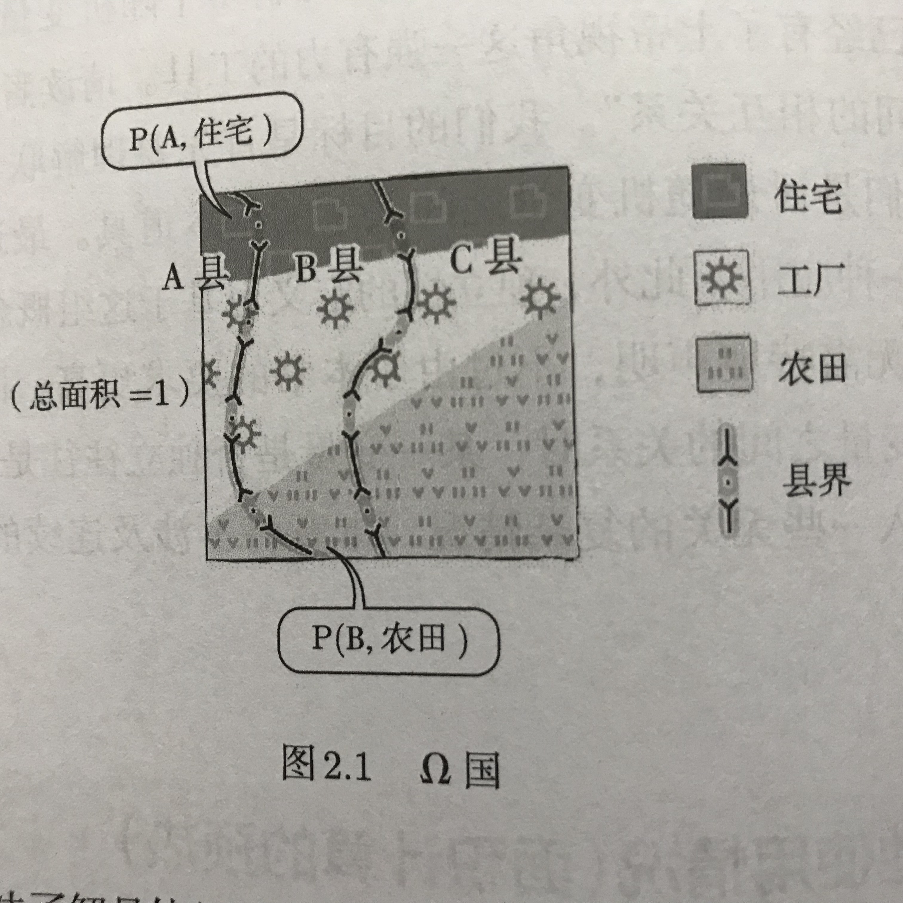

> 程序员的数学2-概率统计

* 概率是面积与体积的泛化
* 随机变量是一种以变量为名的函数

* 矩阵是一种映射
* 概率是一种面积

# 第1部分 聊聊概率这件事

## 第1章 概率的定义

满足条件的三元组（$\Omega 、 F 、 P$）称为概率空间。

### 三扇门（蒙提霍尔的问题 Monty Hall problem）——飞艇视角

> 假设有多个平行世界，同一件事会在所有的世界里重现所有的可能性
> 这些可能性的结果就构成了平行世界集合的平面图
> 也就是，假设结果是确定的，形成概率的原因，是因为不知道自己所在的是哪个世界。
> 所以才使用上帝视角，即俯视所有世界，而不存在某一世界。

* 准备了大量会场，每个会场同时进行游戏（大量的数据）
* 在各个会场中，所有人仅仅是按照事先确定的剧本行动（概率规则固定）
* 只要剧本设定合理，所有会场的结果都能完美的模拟原来事件的发生概率（概率重现）
* 只要从飞艇上俯瞰并统计会场的数量，就能明确判断结论正误

### 1.3 三元组（$\Omega 、 F 、 P$）——上帝视角

* $\Omega$：所有平行世界组合的集合。即整个概率的整体面积，一般用 1 来表示。
    * $\omega$: 表示具体的每一个世界。即整个概率面积中的一个点。也称为样本点或基本事件。
* F: 暂不讨论。
* P: 某个子集的面积。例如 $\Omega$ 中子集 A 则是 P(A)，表示 A 世界的集合。
    * P($\Omega$) = 1

### 1.4 随机变量

> 随机变量即是 $\Omega$ 世界当中的一个函数 $f(\omega)$.
> 该函数可以通过多个 $\omega$ 值求出一个确定的结果，但是由于 $\omega$ 值并不确定，所以这是一个随机变量

$f(u, v) \equiv \begin{cases} 中选& \text (0 \leq v < 1/4, 0 \leq u \leq 1) \\ 落选& \text (1/4 \leq v \leq 1, 0 \leq u \leq 1) \end{cases}$

左侧表示随机变量 $f(u, v)$，右侧表示该随机变量的定义。通过该定义，可以在 $\Omega$ 平面上画出多个区域 $P(f(u, v))$，表示某一种结果的区域。这些区域占总面积的比例，就是这些区域事件的概率。

### 1.5 概率分布

> 只要知道随机变量就可以得到概率分布。

例如 1.4 中的随机变量 $f(u, v)$ 中，中选的面积占了 1/4，落选 3/4。这些就是概率分布。

$P(X=k) = "X(\omega) = k 时区域 \omega 的面积"$

* 每项概率都大于等于 0 且小于等于 1
* 所有概率的和必定为 1

### 1.8 一些注意事项

* 本书
    * 不涉及测度理论及概率论公理
    * 不涉及面积的定义
    * 假定面积的性质与日常生活中的面积相同

## 第2章 多个随机变量之间的关系

理解联合概率，边缘概率与条件概率，他们是讨论随机变量之间关系的基本道具。

### 2.1 各县的土地使用情况（面积计算的预热）

#### 2.1.1 不同县、不同用途的统计（联合概率与边缘概率的预热）

P(residential) = P(A, residential) + P(B, residentital) + P(C, residential)
P(factory) = P(A, factory) + P(B, factory) + P(C, factory)
P(field) = P(A, field) + P(B, field) + P(C, field)

P(A) = P(A, residential) + P(A, factory) + P(A, field)
P(B) = P(B, residential) + P(B, factory) + P(B, field)
P(C) = P(C, residential) + P(C, factory) + P(C, field)

P(A, residential) + P(A, factory) + P(A, field) +
P(B, residential) + P(B, factory) + P(B, field) +
P(C, residential) + P(C, factory) + P(C, field) = 1

#### 2.1.2 特定县、特定用途的比例（条件概率的预热）

A 县中住宅所占面积比例：P(residential | A) = P(A, residential) $\div$ P(A)

因此：
P(residential|A) + P(factory|A) + P(field|A) = 1
P(A, residential) = P(residential|A) $\times$ P(A)

如果互换位置将会表示住宅总面积中 A 县住宅所占的面积：P(A|residential) = P(A, residential) $\div$ P(residential)

#### 2.1.3 倒推比例（贝叶斯公式的预热）

已知：

* P(A) = 0.2, P(B) = 0.32, P(C) = 0.48
* P(residential|A) = 0.2, p(factory|A) = 0.6, P(field|A) = 0.2
* P(residential|B) = 0.5, p(factory|B) = 0.25, P(field|B) = 0.25
* P(residential|C) = 0.25, p(factory|C) = 0.25, P(field|C) = 0.5

求 P(A|factory) 是多少

P(A|factory) = $\frac{P(A, factory)}{P(factory)}$

= $\frac{P(A) \times P(factory|A)}{P(A) \times P(factory|A) + P(B) \times P(factory|B) + P(C) \times P(factory|C)}$
             
= $\frac{0.2 \times 0.6}{0.2 \times 0.6 + 0.32 \times 0.25 + 0.48 \times 0.25}$
             
= $\frac{0.12}{0.12 + 0.08 + 0.12}$
             
= $\frac{0.12}{0.32}$
             
= 0.375

#### 2.1.4 比例相同的情况（独立性的预热）

$\because \begin{cases} P(residential|A) = P(residential|B) = P(residential|C) \\  P(factory|A) = P(factory|B) = P(factory|C) \\ P(field|A) = P(field|B) = P(field|C) \end{cases}$

* residential = 30%, factory = 20%, field = 50%
* A = 10%, B = 30%, C = 60%

$\therefore$ P(A, residential) : P(A, factory) : P(A, field) 
 = P(B, residential) : P(B, factory) : P(B, field) 
 = P(C, residential) : P(C, factory) : P(C, field)
 = 3 : 2 : 5
 
$\therefore$ $\begin{cases} P(residential|(A, B, C)) = P(residential) = 0.3 \\ P(factory|(A, B, C)) = P(factory) = 0.2 \\ P(field|(A, B, C)) = P(field) = 0.5 \end{cases}$

$\therefore$ $\begin{cases} P(A, residential) = P(A) \times P(residential) = 0.03 \\ P(A, factory) = P(A) \times P(factory) = 0.02 \\ P((A, B, C), (residential, factory, field)) = P(A,B,C) \times P(residential, factory, field) \end{cases}$

$\therefore$ $\begin{cases} P(A|residential) = P(A|factory) = P(A|field) = P(A) = 0.1 \\ P((A,B,C)|(Any)) = P(A,B,C) \end{cases}$

$\therefore$ P(A, residential) : P(B, residential) : P(C, residential)
= P(A, factory) : P(B, factory) : P(C, factory)
= P(A, field) : P(B, field) : P(C, field)
= P(A) : P(B) : P(C)

### 2.2 联合概率与边缘概率

#### 2.2.1 两个随机变量

$\because$  假设有随机变量 X, Y

$\therefore$ P(X=a, Y=b), P(X,Y) 表示同时符合两种情况的概率。(参考 P(A, residential))

$\therefore$ P(X=a,Y=b) 称之为联合概率

$\therefore$ 而其中的 P(X=a) 或者 P(Y=b) 称之为边缘概率

$\therefore P(X = a) == \sum_bP(X = a, Y = b) $ 

$\therefore P(Y = b) == \sum_aP(X = a, Y = b) $ 

#### 2.2.2 三个随机变量

### 2.3 条件概率

#### 2.3.1 条件概率的定义

#### 2.3.2 联合分布、边缘分布与条件分布的关系

#### 2.3.3 即使条件中使用的不是等号也一样使用

#### 2.3.4 三个或更多的随机变量

### 2.4 贝叶斯公式

#### 2.4.1 问题设置

#### 2.4.2 贝叶斯的作图曲

#### 2.4.3 贝叶斯公式

### 2.5 独立性

#### 2.5.1 事件的独立性（定义）

#### 2.5.2 事件的独立性（等价表述）

#### 2.5.3 随机变量的独立性

#### 2.5.4 三个或更多随机变量的独立性（需要多加注意）

## 第3章 离散值的概率分布

### 3.1 一些简单的例子

### 3.2 二项分布

## 第4章 连续值得概率分布

## 第5章 协方差距阵，多元正态分布与椭圆

# 第2部分 探讨概率的应用

## 第6章 估计与检验

## 第7章 伪随机数

## 第8章 概率的各类应用

# 附录 A 本书涉及的数学基础知识

# 附录 B 近似公式与不等式

# 附录 C 概率论的补充知识

